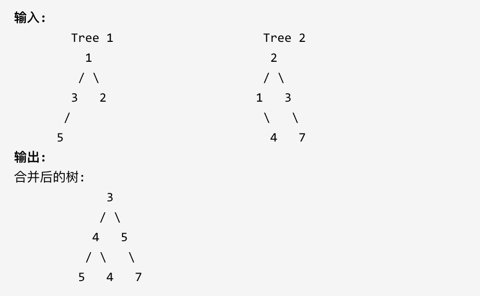

# 654.最大二叉树

[力扣题目地址(opens new window)](https://leetcode.cn/problems/maximum-binary-tree/)

给定一个不含重复元素的整数数组。一个以此数组构建的最大二叉树定义如下：

- 二叉树的根是数组中的最大元素。
- 左子树是通过数组中最大值左边部分构造出的最大二叉树。
- 右子树是通过数组中最大值右边部分构造出的最大二叉树。

通过给定的数组构建最大二叉树，并且输出这个树的根节点。

示例 ：

提示：

给定的数组的大小在 [1, 1000] 之间。

## 题解

我写的

~~~java
class Solution {
    
    public TreeNode constructMaximumBinaryTree(int[] nums) {
        TreeNode root = build(nums, 0, nums.length - 1);
        return root;
    }

    private TreeNode build(int[] nums, int left, int right) {
        if (left > right) return null;
        if (left == right) return new TreeNode(nums[left]);

        int pos = findMax(nums, left, right);
        TreeNode node = new TreeNode(nums[pos]);
        node.left = build(nums, left, pos - 1);
        node.right = build(nums, pos + 1, right);

        return node;
    }
    int findMax(int[] nums, int left, int right) {
        int max = left;
        for (int i = left; i <= right; i++) {
            max = nums[i] > nums[max] ? i : max;
        }
        return max;
    }

}
~~~

代码随想录答案, 其实差不多

~~~java
class Solution {
    public TreeNode constructMaximumBinaryTree(int[] nums) {
        return constructMaximumBinaryTree1(nums, 0, nums.length);
    }

    public TreeNode constructMaximumBinaryTree1(int[] nums, int leftIndex, int rightIndex) {
        if (rightIndex - leftIndex < 1) {// 没有元素了
            return null;
        }
        if (rightIndex - leftIndex == 1) {// 只有一个元素
            return new TreeNode(nums[leftIndex]);
        }
        int maxIndex = leftIndex;// 最大值所在位置
        int maxVal = nums[maxIndex];// 最大值
        for (int i = leftIndex + 1; i < rightIndex; i++) {
            if (nums[i] > maxVal){
                maxVal = nums[i];
                maxIndex = i;
            }
        }
        TreeNode root = new TreeNode(maxVal);
        // 根据maxIndex划分左右子树
        root.left = constructMaximumBinaryTree1(nums, leftIndex, maxIndex);
        root.right = constructMaximumBinaryTree1(nums, maxIndex + 1, rightIndex);
        return root;
    }
}
~~~

# 617.合并二叉树

[力扣题目链接(opens new window)](https://leetcode.cn/problems/merge-two-binary-trees/)

给定两个二叉树，想象当你将它们中的一个覆盖到另一个上时，两个二叉树的一些节点便会重叠。

你需要将他们合并为一个新的二叉树。合并的规则是如果两个节点重叠，那么将他们的值相加作为节点合并后的新值，否则不为 NULL 的节点将直接作为新二叉树的节点。

示例 1:

注意: 合并必须从两个树的根节点开始。

## 题解

递归

~~~java
class Solution {
    public TreeNode mergeTrees(TreeNode root1, TreeNode root2) {
        if (null == root1 && null == root2) return null;
        if (null == root1) return root2;
        if (null == root2) return root1;
        TreeNode root = new TreeNode(root1.val + root2.val);

        root.left = mergeTrees(root1.left, root2.left);
        root.right = mergeTrees(root1.right, root2.right);

        return root;
    }
}
~~~

迭代

~~~java
class Solution {
    public TreeNode mergeTrees(TreeNode root1, TreeNode root2) {
       if (null == root1) return root2;
       if (null == root2) return root1;
       Deque<TreeNode> stack = new LinkedList<>();
       stack.push(root1);
       stack.push(root2);

       while (!stack.isEmpty()) {
           TreeNode node2 = stack.pop();
           TreeNode node1 = stack.pop();
           node1.val += node2.val;
           if (node2.right != null && node1.right != null) {
                stack.push(node1.right);
                stack.push(node2.right);
            } else {
                if (node1.right == null) {
                    node1.right = node2.right;
                }
            }
            if (node2.left != null && node1.left != null) {
                stack.push(node1.left);
                stack.push(node2.left);
            } else {
                if (node1.left == null) {
                    node1.left = node2.left;
                }
            }
       }
       return root1;
    }
}
~~~

