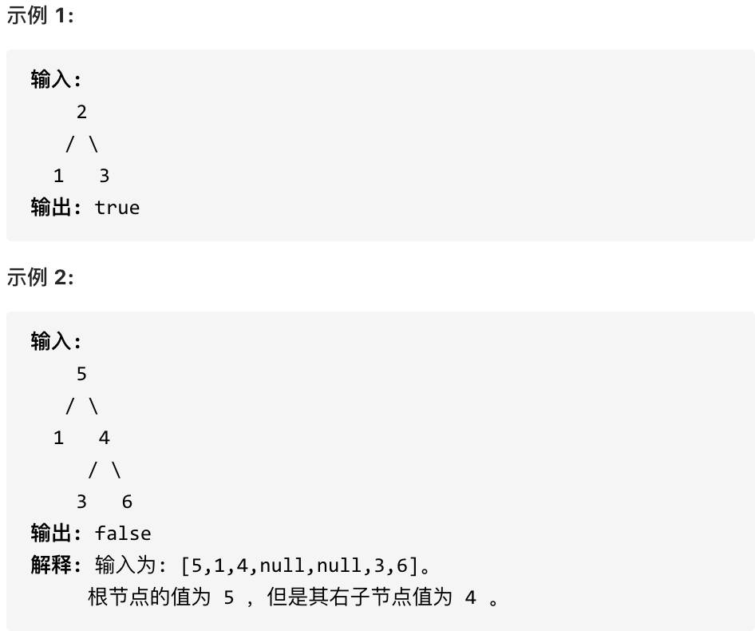
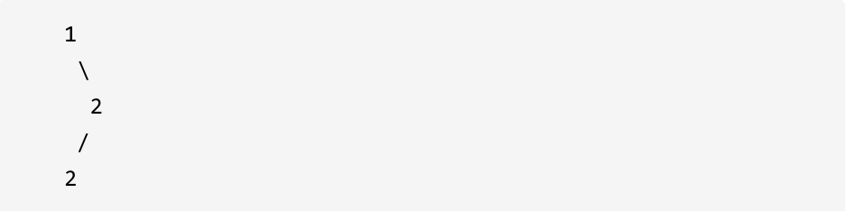

# 700.二叉搜索树中的搜索

[力扣题目地址(opens new window)](https://leetcode.cn/problems/search-in-a-binary-search-tree/)

给定二叉搜索树（BST）的根节点和一个值。 你需要在BST中找到节点值等于给定值的节点。 返回以该节点为根的子树。 如果节点不存在，则返回 NULL。

例如，

在上述示例中，如果要找的值是 5，但因为没有节点值为 5，我们应该返回 NULL。

## 题解

很简单, 先用迭代写一个

~~~java
class Solution {
    public TreeNode searchBST(TreeNode root, int val) {
        TreeNode cur = root;
        while (null != cur) {
            if (cur.val == val) return cur;
            else if (cur.val > val) cur = cur.left;
            else cur = cur.right;
        }
        return cur;
    }
}
~~~

递归写一个

~~~java
class Solution {
    TreeNode res = null;
    public TreeNode searchBST(TreeNode root, int val) {
        if (null == root) return null;
        if (root.val == val) return root;
        else if(root.val > val) res = searchBST(root.left, val);
        else res = searchBST(root.right, val);
        return res;
    }
}
~~~

So Easy, 妈妈再也不用担心我的学习了

# 98.验证二叉搜索树

[力扣题目链接(opens new window)](https://leetcode.cn/problems/validate-binary-search-tree/)

给定一个二叉树，判断其是否是一个有效的二叉搜索树。

假设一个二叉搜索树具有如下特征：

- 节点的左子树只包含小于当前节点的数。
- 节点的右子树只包含大于当前节点的数。
- 所有左子树和右子树自身必须也是二叉搜索树。

## 题解

昨天写过, 今天又遇到了,再写一遍(这会用long, 上回用的null做特殊判断)

~~~java
class Solution {
    public boolean isValidBST(TreeNode root) {
        return isVaild(root,Long.MIN_VALUE, Long.MAX_VALUE);
    }

    private boolean isVaild(TreeNode root, long min, long max) {
        if (null == root) return true;

        if (root.val <= min || root.val >= max) return false;

        long rightMin = root.val > min ? root.val : min;
        long leftMax = root.val < max ? root.val : max;

        return isVaild(root.left, min, leftMax) && isVaild(root.right, rightMin, max); 
    }
}
~~~

迭代写法, 我没写, 理解起来倒是简单, 但是写我不一定能想到

~~~java
//非通用写法
public boolean isValidBST(TreeNode root) {
        if (null == root) return true;

        Deque<TreeNode> stack = new LinkedList<>();
        TreeNode pre = null;
        while (null != root || !stack.isEmpty()) {
            while (null != root) {
                stack.push(root);
                root = root.left;
            }

            TreeNode pop = stack.pop();

            if (pre != null && pop.val <= pre.val) {
                return false;
            }
            pre = pop;

            root = pop.right;
        }

        return true;
    }

   4
  2
 1 3

//通用写法
       
class Solution {
    public boolean isValidBST(TreeNode root) {
        Stack<TreeNode> stack = new Stack<>();
        TreeNode pre = null;
        if(root != null)
            stack.add(root);        
        while(!stack.isEmpty()){
            TreeNode curr = stack.peek();
            if(curr != null){
                stack.pop();
                if(curr.right != null)
                    stack.add(curr.right);
                stack.add(curr);
                stack.add(null);
                if(curr.left != null)
                    stack.add(curr.left);
            }else{
                stack.pop();
                TreeNode temp = stack.pop();
                if(pre != null && pre.val >= temp.val)
                    return false;
                pre = temp;
            }
        }
        return true;
    }
}
~~~

# 530.二叉搜索树的最小绝对差

[力扣题目链接(opens new window)](https://leetcode.cn/problems/minimum-absolute-difference-in-bst/)

给你一棵所有节点为非负值的二叉搜索树，请你计算树中任意两节点的差的绝对值的最小值。

示例：

提示：树中至少有 2 个节点。

## 题解

~~~java
真的贼巧, 做这道题之前刷leetcode遇到这个提问  https://leetcode.cn/circle/discuss/5csSmY/, 当时也是和评论区想的一样
排序+一次遍历, 时间复杂度 O(nlogn)
    
巧的是,刚好几分钟后就做这道题,为什么说很巧呢, 因为其实两道题思路是一样的

        4
       / \
      2   6
     / \  
    1   3
    
二叉搜索树其实就是一个排序好的数组,我们试着将这棵树映射到一维数组
          4
        / | \
      2   |  6
     / \  |  |
    1 | 3 |  |
    | | | |  |
    1 2 3 4  6 
    
那么这是怎么映射的呢?  其实就是中序遍历!
其实平常我是懒得写题解的,但是今天实在是太巧了,记录一下 
    
~~~

递归写法

~~~java
class Solution {
    int min = Integer.MAX_VALUE;
    Integer pre = null;
    public int getMinimumDifference(TreeNode root) {
        traversal(root);
        return min;
    }
    void traversal(TreeNode root) {
        if (null == root) return;

        traversal(root.left);
        if (null != pre && Math.abs(root.val - pre.intValue()) < min) min = Math.abs(root.val - pre);
        pre = Integer.valueOf(root.val);
        traversal(root.right);

    }
}
~~~

通用迭代写法

~~~java
class Solution {
    public int getMinimumDifference(TreeNode root) {
        Deque<TreeNode> stack = new LinkedList<>();
        stack.push(root);
        Integer pre = null;
        int min = Integer.MAX_VALUE;
        while (!stack.isEmpty()) {
            TreeNode node = stack.pop();
            if (null != node) {
                if (null != node.left) stack.push(node.left);
                stack.push(node);
                stack.push(null);
                if (null != node.right) stack.push(node.right);
            }else {
                node = stack.pop();
                if (null != pre && Math.abs(node.val - pre.intValue()) < min) min = Math.abs(node.val - pre);
                pre = Integer.valueOf(node.val);
            }   
        }
        return min;
    }
}
~~~

非通用迭代写法(没错,我就练练)

~~~java
lass Solution {
    public int getMinimumDifference(TreeNode root) {
        Deque<TreeNode> stack = new LinkedList<>();
        Integer pre = null;
        int min = Integer.MAX_VALUE;
        TreeNode cur = root;
        while (!stack.isEmpty() || null != cur) {
            if (null != cur) {
                stack.push(cur);
                cur = cur.left;
            }else {
                cur = stack.pop();
                if (null != pre && Math.abs(cur.val - pre.intValue()) < min) min = Math.abs(cur.val - pre);
                pre = Integer.valueOf(cur.val);
                cur = cur.right;
            }
        }
        return min;
    }
}
~~~

#  501.二叉搜索树中的众数

[力扣题目链接(opens new window)](https://leetcode.cn/problems/find-mode-in-binary-search-tree/)

给定一个有相同值的二叉搜索树（BST），找出 BST 中的所有众数（出现频率最高的元素）。

假定 BST 有如下定义：

- 结点左子树中所含结点的值小于等于当前结点的值
- 结点右子树中所含结点的值大于等于当前结点的值
- 左子树和右子树都是二叉搜索树

例如：

给定 BST [1,null,2,2],

返回[2].

提示：如果众数超过1个，不需考虑输出顺序

进阶：你可以不使用额外的空间吗？（假设由递归产生的隐式调用栈的开销不被计算在内）

常规Map做法(做完想了想,还是TreeMap好,不过无所谓,主要是为了抛砖引玉)

~~~java
class Solution {
    public int[] findMode(TreeNode root) {
        int max = Integer.MIN_VALUE;
        Map<Integer,Integer> map = new HashMap<>();
        Deque<TreeNode> queue = new LinkedList<>();
        List<Integer> res = new LinkedList<>();
        queue.offer(root);
        while (!queue.isEmpty()) {
            int size = queue.size();
            for (int i  = 0; i < size; i++) {
                TreeNode node = queue.poll();
                map.put(node.val, map.getOrDefault(node.val, 0) + 1);
                if (null != node.left) queue.offer(node.left);
                if (null != node.right) queue.offer(node.right);
            }
        }

        for (Map.Entry<Integer, Integer> entry : map.entrySet()) {
            int cur = entry.getValue().intValue();
            // System.out.println(entry.getKey() +" : "+entry.getValue());
            if (cur > max) {
                max = cur;
            }
        }

    for (Map.Entry<Integer, Integer> entry : map.entrySet()) {
        int cur = entry.getValue().intValue();
        if (cur == max) {
            res.add(entry.getKey());
        }
    }
        return res.stream().mapToInt(Integer::intValue).toArray();
    }
}
~~~

还是利用上面讲过的,二叉搜索树中序遍历有序的特点(先懒洋洋一下,下午补全)

~~~java
class Solution {
    ArrayList<Integer> resList;
    int maxCount;
    int count;
    TreeNode pre;

    public int[] findMode(TreeNode root) {
        resList = new ArrayList<>();
        maxCount = 0;
        count = 0;
        pre = null;
        findMode1(root);
        int[] res = new int[resList.size()];
        for (int i = 0; i < resList.size(); i++) {
            res[i] = resList.get(i);
        }
        return res;
    }

    public void findMode1(TreeNode root) {
        if (root == null) {
            return;
        }
        findMode1(root.left);

        int rootValue = root.val;
        // 计数
        if (pre == null || rootValue != pre.val) {
            count = 1;
        } else {
            count++;
        }
        // 更新结果以及maxCount
        if (count > maxCount) {
            resList.clear();
            resList.add(rootValue);
            maxCount = count;
        } else if (count == maxCount) {
            resList.add(rootValue);
        }
        pre = root;

        findMode1(root.right);
    }
}
~~~

