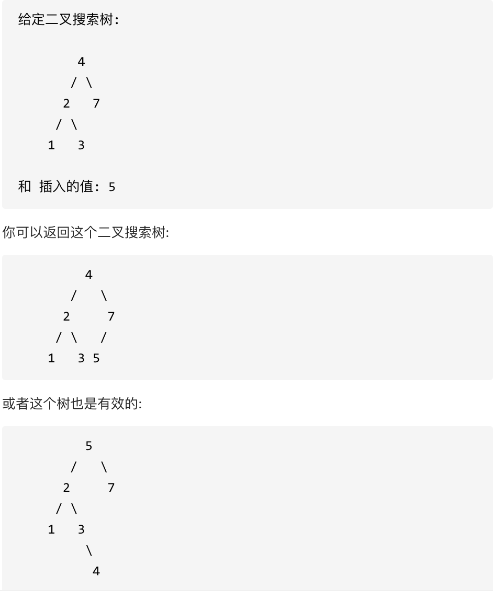
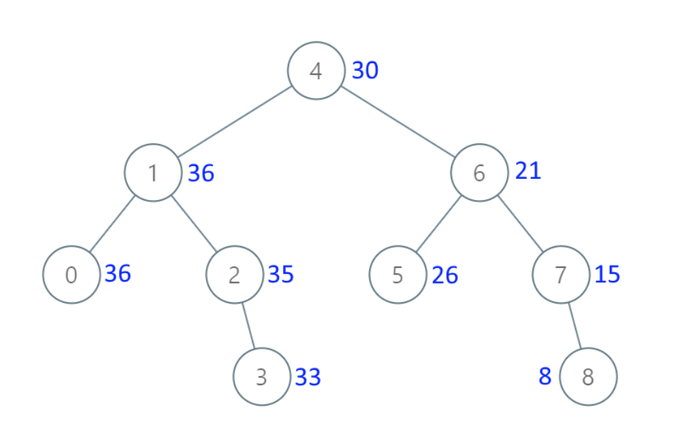

# 701.二叉搜索树中的插入操作

[力扣题目链接(opens new window)](https://leetcode.cn/problems/insert-into-a-binary-search-tree/)

给定二叉搜索树（BST）的根节点和要插入树中的值，将值插入二叉搜索树。 返回插入后二叉搜索树的根节点。 输入数据保证，新值和原始二叉搜索树中的任意节点值都不同。

注意，可能存在多种有效的插入方式，只要树在插入后仍保持为二叉搜索树即可。 你可以返回任意有效的结果。

提示：

- 给定的树上的节点数介于 0 和 10^4 之间
- 每个节点都有一个唯一整数值，取值范围从 0 到 10^8
- -10^8 <= val <= 10^8
- 新值和原始二叉搜索树中的任意节点值都不同

## 迭代

~~~java
class Solution {
    public TreeNode insertIntoBST(TreeNode root, int val) {
        if (null == root) return new TreeNode(val);
        TreeNode cur = root;
        while (null != cur) {
            if (val > cur.val) {
                if (null == cur.right) {
                    cur.right = new TreeNode(val);
                    break;
                }
                else cur = cur.right;
            }else{
                if (null == cur.left) {
                    cur.left = new TreeNode(val);
                    break;
                }
                else cur = cur.left;
            }
        }
        return root;
    }
}
~~~

## 递归

~~~java
class Solution {
    public TreeNode insertIntoBST(TreeNode root, int val) {
        if (null == root) return new TreeNode(val);
        traversal(root, val);
        return root;
    }

    void traversal(TreeNode cur, int val) {
        if (null == cur) return;
        
       if (val > cur.val) {
                if (null == cur.right) {
                    cur.right = new TreeNode(val);
                    return;
                }
                traversal(cur.right, val);
            }else{
                if (null == cur.left) {
                    cur.left = new TreeNode(val);
                    return;
                }
                traversal(cur.left, val);
            }
    }

~~~

有返回值的递归

~~~java
class Solution {
    public TreeNode insertIntoBST(TreeNode root, int val) {
        if (null == root) {
            return new TreeNode(val);
        }
        if (val > root.val) {
            root.right = insertIntoBST(root.right, val);
        }else {
            root.left = insertIntoBST(root.left, val);
        }

        return root;
    
    }    
}
~~~

# 450.删除二叉搜索树中的节点

[力扣题目链接(opens new window)](https://leetcode.cn/problems/delete-node-in-a-bst/)

给定一个二叉搜索树的根节点 root 和一个值 key，删除二叉搜索树中的 key 对应的节点，并保证二叉搜索树的性质不变。返回二叉搜索树（有可能被更新）的根节点的引用。

一般来说，删除节点可分为两个步骤：

首先找到需要删除的节点； 如果找到了，删除它。 说明： 要求算法时间复杂度为 $O(h)$，h 为树的高度。

示例:

~~~java
class Solution {
    public TreeNode deleteNode(TreeNode root, int key) {
        if (null == root) return root;

        if (key == root.val) {

            if (null == root.left && null == root.right) {
                root = null;
            }else if (null == root.left) {
                root = root.right;
            }else if (null == root.right) {
                root = root.left;
            }else {
                TreeNode cur = root.right;
                while (cur.left != null) {
                    cur = cur.left;
                }
                cur.left = root.left;
                root = root.right;
            }
            return root;
        }
        if (root.val > key) root.left = deleteNode(root.left, key);
        if (root.val < key) root.right = deleteNode(root.right, key);
        return root;
        
    }
}
~~~

## 迭代

~~~java
class Solution {
    public TreeNode deleteNode(TreeNode root, int key) {
       TreeNode dummy = new TreeNode(-1, root, null);
       TreeNode cur = root;
       TreeNode pre = dummy;
       while(null != cur) {
           if (key == cur.val) {
               if (null == cur.left && null == cur.right) {
                   if (null != pre.left && pre.left.val == key) pre.left = null;
                   else pre.right = null;
               }else if (null == cur.left) {
                   if (null != pre.left && pre.left.val == key) pre.left = cur.right;
                   else pre.right = cur.right;
               }else if (null == cur.right) {
                   if (null != pre.left && pre.left.val == key) pre.left = cur.left;
                   else pre.right = cur.left;
               }else {
                   TreeNode index = cur.right;
                   while (null != index.left) {
                       index = index.left;
                   }
                   index.left = cur.left;
                   if (null != pre.left && pre.left.val == key) pre.left = cur.right;
                   else pre.right = cur.right;
               }
               break;
           }
           if (key > cur.val) {
               pre = cur;
               cur = cur.right;
           }
           else {
               pre = cur;
               cur = cur.left;
           }
       }

       return dummy.left; 
    }
}
~~~

# 669. 修剪二叉搜索树

[力扣题目链接(opens new window)](https://leetcode.cn/problems/trim-a-binary-search-tree/)

给定一个二叉搜索树，同时给定最小边界L 和最大边界 R。通过修剪二叉搜索树，使得所有节点的值在[L, R]中 (R>=L) 。你可能需要改变树的根节点，所以结果应当返回修剪好的二叉搜索树的新的根节点。

~~~java
class Solution {
    public TreeNode trimBST(TreeNode root, int low, int high) {
        if (null == root) return null;
        while (null != root && (root.val < low || root.val > high)) {
            root = deleteNode(root, root.val);
        }
        if (null != root) root.left = trimBST(root.left, low, high);
        if (null != root) root.right = trimBST(root.right, low, high);
        return root; 
    }
    public TreeNode deleteNode(TreeNode root, int key) {
        if (null == root) return root;

        if (key == root.val) {

            if (null == root.left && null == root.right) {
                root = null;
            }else if (null == root.left) {
                root = root.right;
            }else if (null == root.right) {
                root = root.left;
            }else {
                TreeNode cur = root.right;
                while (cur.left != null) {
                    cur = cur.left;
                }
                cur.left = root.left;
                root = root.right;
            }
            return root;
        }
        if (root.val > key) root.left = deleteNode(root.left, key);
        if (root.val < key) root.right = deleteNode(root.right, key);
        return root;
        
    }
}
~~~

~~~java
class Solution {
    public TreeNode trimBST(TreeNode root, int low, int high) {
        if (root == null) {
            return null;
        }
        if (root.val < low) {
            return trimBST(root.right, low, high);
        }
        if (root.val > high) {
            return trimBST(root.left, low, high);
        }
        // root在[low,high]范围内
        root.left = trimBST(root.left, low, high);
        root.right = trimBST(root.right, low, high);
        return root;
    }
}
~~~

# 538.把二叉搜索树转换为累加树

[力扣题目链接(opens new window)](https://leetcode.cn/problems/convert-bst-to-greater-tree/)

给出二叉 搜索 树的根节点，该树的节点值各不相同，请你将其转换为累加树（Greater Sum Tree），使每个节点 node 的新值等于原树中大于或等于 node.val 的值之和。

提醒一下，二叉搜索树满足下列约束条件：

节点的左子树仅包含键 小于 节点键的节点。 节点的右子树仅包含键 大于 节点键的节点。 左右子树也必须是二叉搜索树。

示例 1：

- 输入：[4,1,6,0,2,5,7,null,null,null,3,null,null,null,8]
- 输出：[30,36,21,36,35,26,15,null,null,null,33,null,null,null,8]

示例 2：

- 输入：root = [0,null,1]
- 输出：[1,null,1]

示例 3：

- 输入：root = [1,0,2]
- 输出：[3,3,2]

示例 4：

- 输入：root = [3,2,4,1]
- 输出：[7,9,4,10]

提示：

- 树中的节点数介于 0 和 104 之间。
- 每个节点的值介于 -104 和 104 之间。
- 树中的所有值 互不相同 。
- 给定的树为二叉搜索树。

## 递归法

此处重新创建了树,耗内存

~~~java
class Solution {
    int sum = 0;
    public TreeNode convertBST(TreeNode root) {
     if (null == root) {
            return null;
        }

        TreeNode right = convertBST(root.right);
        sum += root.val;
        TreeNode accRoot = new TreeNode(sum);
        TreeNode left = convertBST(root.left);
        accRoot.left = left;
        accRoot.right = right;
        return accRoot;   
    }
}
~~~

改了改

~~~java
class Solution {
    int sum = 0;
    public TreeNode convertBST(TreeNode root) {
     if (null == root) {
            return null;
        }
        TreeNode right = convertBST(root.right);
        sum += root.val;
        root.val = sum;
        TreeNode accRoot = new TreeNode(sum);
        TreeNode left = convertBST(root.left);
        return root;   
    }
}
~~~

## 迭代法

使用通用的迭代法耗时 会是两倍

~~~java
class Solution {
    public TreeNode convertBST(TreeNode root) {
        if (null == root) return null;
        Deque<TreeNode> stack = new LinkedList<>();
        int sum = 0;
        stack.push(root);
        while (!stack.isEmpty()) {
            TreeNode node = stack.pop();
            if (null != node) {
                if (null != node.left) stack.push(node.left);
                stack.push(node);
                stack.push(null);
                if (null != node.right) stack.push(node.right);
            }else {
                node = stack.pop();
                node.val += sum; 
                sum = node.val;
            }
            
        }
        return root;
    }
}
~~~

